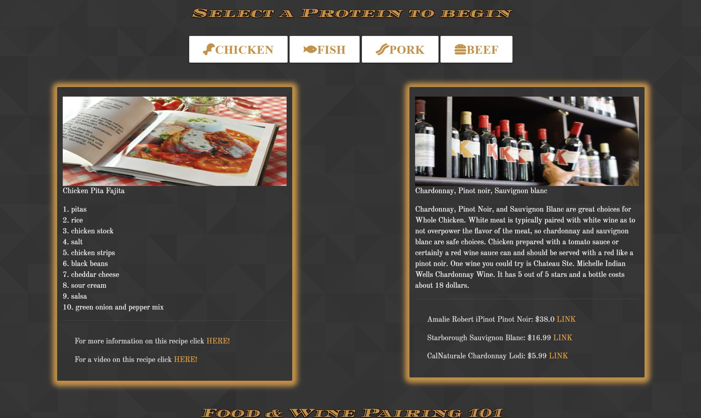

# Wine&Dines
https://github.com/andrewrb22/-.theFederationOfCoders-

## Technologies
Built with Materialize, jQuery, fontawesone, spoonacular API, and youtuve API

## Summary
In Wine&Dines, you will be able to pair a dish with your choice of meat with a few wines. When the user arrives to the page, they will be greeted with our front page. Upon clicking the down arrow, the user will encounter a series of buttons. The user then will select the protein of their choice to randomly generate a recipe. The ingredients of this dish will be listed following a link to the full recipe. If they need a bit more guidance on how to prepare this recipe, a link with a video on how to do so will also be provided. With said recipe we will pair a series of wines that elevate the flavors of the dish. Links to each wine will be provided if the user is looking to buy a bottle or 2. Lastly, towards the end of our page, you will encounter a tutorial that dives deeper on the art of pairing wines with food.

## License

Licensed under the [MIT License](LICENSE)

## Contact

email: christianmarquez41@gmail.com